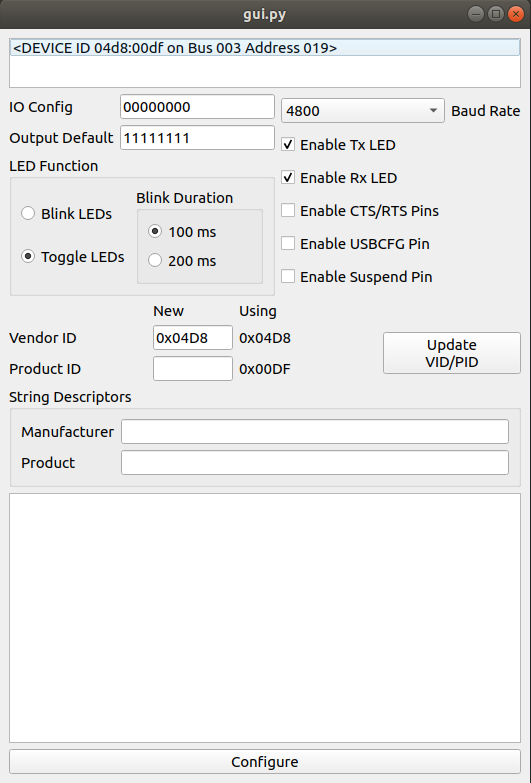

Drive the MCP2200 with python
==============================

MCP2200 is the Microchip USB-Serial transceiver. [Datasheet](http://www.microchip.com/wwwproducts/en/en546923)

The USB link is also used to configure the device, and, as a bonus, to easily manage some GPIO and EEPROM on the device.

When connected to a computer, it creates 2 new USB devices
- A USB CDC that's the actual virtual serial port any tool will use to communicate.
- A USB HID, that can be used to personalize and configure the chip.

The MCP2200 is delivered along with a user interface that helps easily configuring it.
BUT... it's pure Windows !!

Thanksfully, Microchip delivers this document as well : [The fully documented HID protocol](http://ww1.microchip.com/downloads/en/DeviceDoc/93066A.pdf)

This project implements the microchip specifications at 3 levels :
- The graphical configuration tool
- The USB HID specification
- The API as described in the component's datasheet

# GUI


# Example at USB HID level
``` python
from cdtx.mcp2200.device import MCP2200Device

try:
    dev = mcp2200Device(autoConnect=True)
except:
    sys.exit('Cannot connect the device')

try:
    # Set GPIO 0 as output and set it
    config = dev.read_all()
    # Reset bit0 of IO_bmap
    config['IO_bmap'] &= 0xFE
    dev.configure(**config)
    dev.set_clear_outputs(Set_bmap=0x01, Clear_bmap=0x00)
finally:
    mcp2200.disconnects()
```

# Example at API level
``` python
from cdtx.mcp2200.api import SimpleIOClass

# Init class and connect device
dev = SimpleIOClass()
dev.InitMCP2200(0x04d8, 0x00df)
assert dev.GetNoOfDevices() == 1

# Set GPIO 0 as output and set it
dev.SelectDevice(0)
assert dev.IsConnected() == True
# Set all pins as outputs
dev.ConfigureIO(0x00)
dev.SetPin(0)
assert dev.ReadPinValue(0) == 1

```

# Problem with permissions ?
    1. Quick and dirty solution is to install and run as root

    2. Prefer allowing current user to manage USB devices

    Add the following rule to file /etc/udev/rules.d/50-myrules.rules (create if necessary)
    ```
    ATTRS{idVendor}=="04d8", ATTRS{idProduct}=="00df", GROUP:="plugdev", MODE="0660"
    ```

    The current user must belong to the __plugdev__ group
    ```
    sudo usermode -a -G plugdev ${USER}
    ```

    [Source](https://askubuntu.com/questions/112568/how-do-i-allow-a-non-default-user-to-use-serial-device-ttyusb0)
